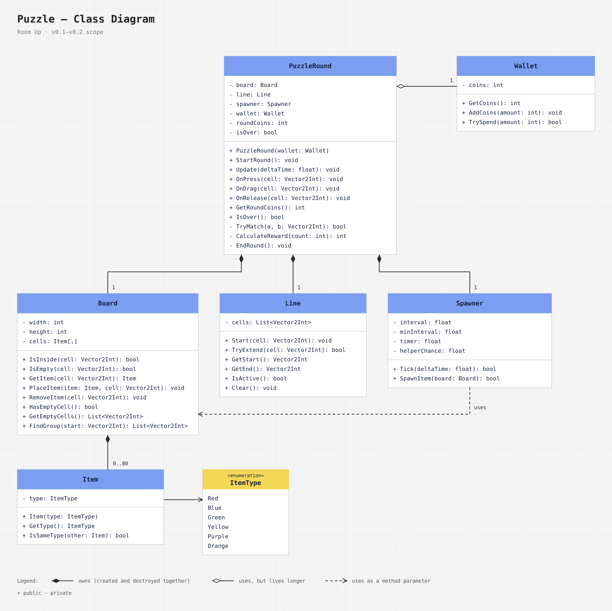
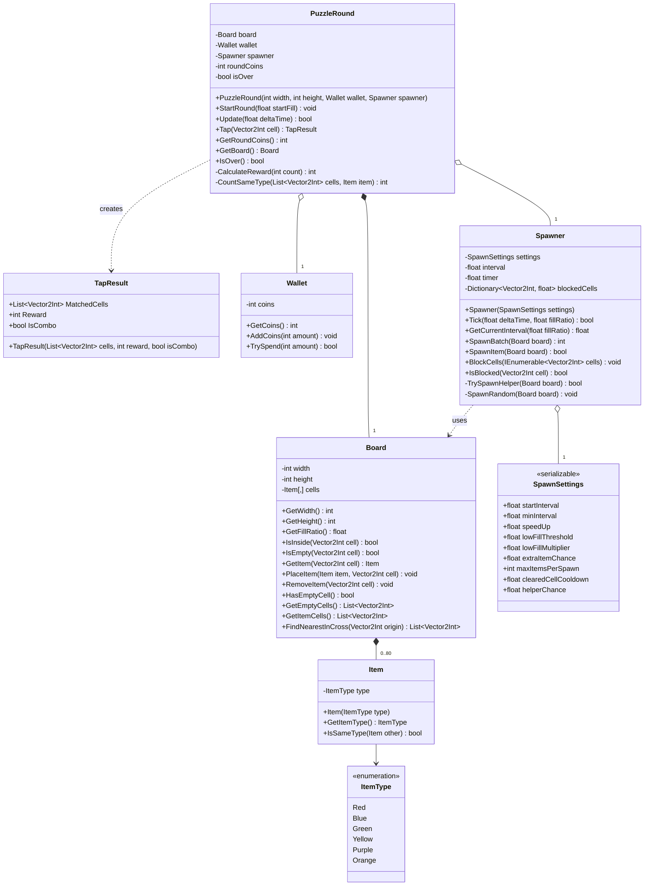
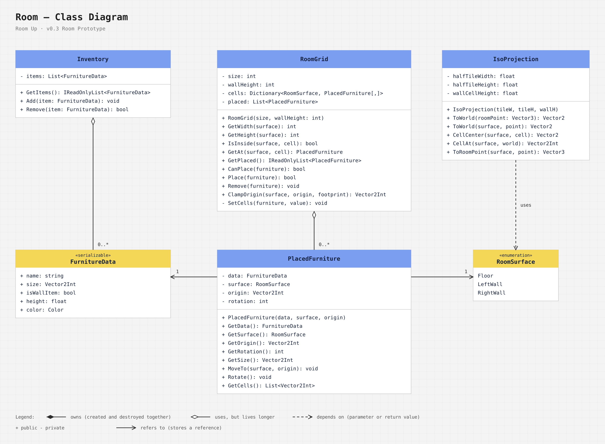
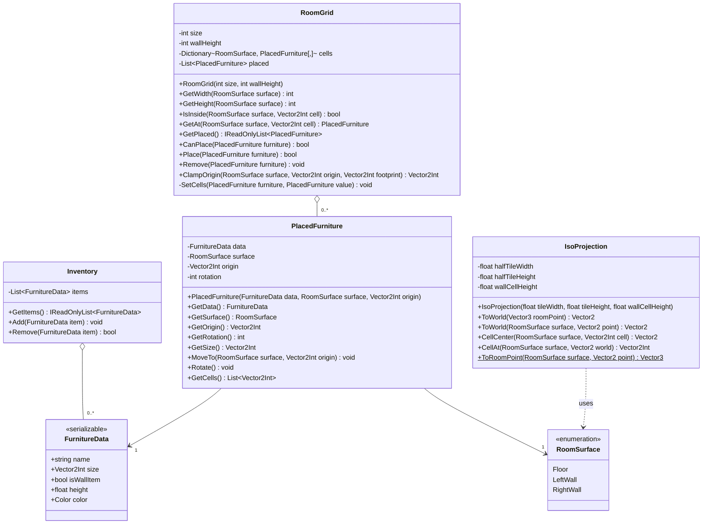

# Class Diagrams

This document describes the classes of **Room Up** (working title):

- [Puzzle](#puzzle) — as of milestone **v0.2 Puzzle Complete**
- [Room](#room) — as of milestone **v0.3 Room Prototype**

Shop and save classes will be added in later milestones.

---

## Notation

| Symbol | Meaning |
|---|---|
| `+` / `-` | public / private |
| `Name(param: Type): ReturnType` | method signature |
| Filled diamond ◆ | **Composition** — the owner creates the part, and the part does not exist without it |
| Hollow diamond ◇ | **Aggregation** — the owner receives the part from outside, and the part can live longer |
| Dashed arrow | **Dependency** — the class only uses the other one as a parameter or a return value |
| Solid arrow | **Association** — the class keeps a reference to the other one |
| `1`, `0..80`, `0..*` | **Multiplicity** — how many objects take part in the relation (`*` = any number) |

---

## Puzzle

*Image generated by `docs/diagrams/src/class_diagram.py`. A Mermaid version is at the end of this section.*

### Two Layers

The code is split into two layers, so the game rules never depend on how things are drawn.

| Layer | Classes | Knows about Unity scenes? |
|---|---|---|
| **Logic** (this diagram) | `PuzzleRound`, `Board`, `Spawner`, `SpawnSettings`, `Wallet`, `TapResult`, `Item`, `ItemType` | No — plain C# classes |
| **Unity components** | `PuzzleController`, `BoardView`, `BoardInput`, `LineView`, `HudView`, `ResultsView`, `CameraFitter` | Yes — `MonoBehaviour`s on objects in the scene |

`PuzzleController` connects the two: it creates the logic objects, forwards taps from `BoardInput` to `PuzzleRound`, and asks the views to redraw.

---

### Classes

#### `PuzzleRound` — the rules of one round
Owns the board, receives the wallet and the spawner from outside.

| Member | Why it exists |
|---|---|
| `StartRound(startFill)` | Fills ~40% of the board with random items |
| `Update(deltaTime)` | Ticks the spawner. Returns `true` when new items appeared, so the view can redraw. Sets `isOver` when an item cannot fit |
| `Tap(cell)` | The core rule: from an empty cell, finds the nearest item in each direction, removes every type found 2+ times, blocks the cleared cells for spawning and pays the reward. Returns a `TapResult` |
| `CalculateReward(count)` | 2 coins per item, +3 per item above two for a combo |

#### `TapResult` — what one tap did
Read-only result object: matched cells, reward and whether it was a combo. The controller uses it to draw the links and update the HUD.

#### `Board` — the grid
The single source of truth for item positions.

- `FindNearestInCross(origin)` walks up, down, left and right from `origin` and returns the first item cell found in each direction (0–4 cells).
- `GetFillRatio()` — the share of filled cells, used by the spawner to speed up on an almost empty board.

#### `Spawner` — new items over time
- `Tick(deltaTime, fillRatio)` counts time and returns `true` when it is time to spawn. The interval gets 3% shorter after each spawn and is shorter while the board is less than 30% full.
- `SpawnBatch(board)` places 1–3 items. Returns `0` if the board is full — this ends the round.
- `TrySpawnHelper(board)` places an item so that an empty cell sees it and an existing item of the same type.
- `BlockCells(cells)` / `IsBlocked(cell)` — cleared cells cannot receive new items for a short time.

#### `SpawnSettings` — tuning
All spawn numbers in one `[System.Serializable]` class, shown as one group in the Inspector of `PuzzleController`.

#### `Wallet` — coins
Only counts. It does not know *why* coins are added or *what* they are spent on.

#### `Item` and `ItemType`
An item only knows its type. Its position lives in `Board`.

---

### Design Principles Used

- **Single responsibility** — each class has one job: `Board` stores, `Spawner` adds items, `Wallet` counts, `PuzzleRound` applies the rules.
- **Single source of truth** — every piece of data lives in exactly one place (e.g. positions only in `Board`).
- **Logic separate from Unity** — logic classes do not draw or read input, so they are easy to test and the visuals can change without touching the rules.
- **Dependencies passed in** — `PuzzleRound` receives `Wallet` and `Spawner` in its constructor instead of creating them, so a new round can start with the same wallet.

---

Mermaid source

---

## Room

*Image generated by `docs/diagrams/src/room_class_diagram.py`. A Mermaid version is at the end of this section.*

### Two Layers

| Layer | Classes | Knows about Unity scenes? |
|---|---|---|
| **Logic** (this diagram) | `RoomGrid`, `PlacedFurniture`, `FurnitureData`, `Inventory`, `IsoProjection`, `RoomSurface` | No — plain C# classes |
| **Unity components** | `RoomController`, `RoomView`, `FurnitureView`, `RoomInput`, `RoomHud` | Yes — `MonoBehaviour`s on the `Room` object |

`RoomController` connects the two: it creates the grid and the inventory, reacts to taps and buttons, and asks the views to redraw. `MeshBuilder` is a small helper that both views use to build shapes from quads.

### Classes

#### `RoomGrid` — the room and what stands in it
Three grids: the floor and two walls. Each cell knows which `PlacedFurniture` covers it.

- `CanPlace(furniture)` — every cell of the footprint is inside the surface and free, and the item is on the right kind of surface (floor items on the floor, wall items on a wall).
- `Place` / `Remove` — mark or free the cells and keep the list of placed items.
- `ClampOrigin(...)` — keeps a footprint inside the surface while it is dragged.

#### `PlacedFurniture` — one item in the room
Stores *where* the item is: surface, origin cell (the corner with the smallest x and y) and rotation 0–3.
`GetSize()` swaps width and depth for rotations 1 and 3, and `GetCells()` lists all cells of the footprint.

#### `FurnitureData` — what an item is
Name, footprint, floor or wall item, box height and placeholder color. `[System.Serializable]`, so the test list is edited in the Inspector of `RoomController`. In v0.4 the shop will use the same data.

#### `Inventory` — items not placed yet
Only a list. It does not know about the room or the shop.

#### `IsoProjection` — room cells ↔ screen
All isometric math in one place.

- A point in the room is `(x, y, z)`: `x` and `y` on the floor, `z` up the wall.
- `ToWorld` turns it into a screen position: `x` goes down-right, `y` goes down-left, `z` goes up.
- `CellAt` does the opposite: which cell is under the finger.
- The left wall is the plane `x = 0`, the right wall is `y = 0`, so one formula works for all three surfaces.

#### `RoomSurface`
`Floor`, `LeftWall` or `RightWall`.

### Design Principles Used

- **Data vs state** — `FurnitureData` describes an item kind and never changes; `PlacedFurniture` is one placed copy with its own position. Two chairs share data but have different positions.
- **Same split as the puzzle** — logic classes do not draw, so pixel-art sprites in v0.5 only change `RoomView` and `FurnitureView`.
- **One source of truth** — which cell is taken lives only in `RoomGrid`.

Mermaid source

