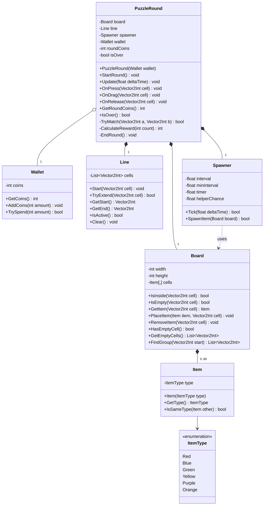

# Class Diagram — Puzzle

This document describes the classes of the **puzzle** part of **Room Up** (working title) — the scope of milestones **v0.1 Puzzle Prototype** and **v0.2 Puzzle Complete**.
Room, shop and save classes will be added in later milestones.

*Image generated by `docs/diagrams/src/class_diagram.py`. A Mermaid version is at the end of this page.*

---

## Notation

| Symbol | Meaning |
|---|---|
| `+` / `-` | public / private |
| `Name(param: Type): ReturnType` | method signature |
| Filled diamond ◆ | **Composition** — the owner creates the part, and the part does not exist without it |
| Hollow diamond ◇ | **Aggregation** — the owner uses the part, but the part lives longer |
| Dashed arrow | **Dependency** — the class only receives the other one as a method parameter |
| `1`, `0..80` | **Multiplicity** — how many objects take part in the relation |

---

## Classes

### `PuzzleRound` — the coordinator
Runs one round of the puzzle. It does not draw anything and does not read touches itself: the UI layer calls `OnPress`, `OnDrag` and `OnRelease` with the cell under the finger, and `Update` every frame.

| Member | Why it exists |
|---|---|
| `board`, `line`, `spawner` | Created by the round and destroyed with it (composition) |
| `wallet` | Received in the constructor. The player's coins exist before and after a round (aggregation) |
| `roundCoins` | Coins earned in this round only — shown on the Round Results screen |
| `isOver` | Set when the board is full |
| `StartRound()` | Clears the board and fills ~40% of the cells with random items |
| `Update(deltaTime)` | Ticks the spawner. When `Tick` says "time to spawn", calls `SpawnItem`. If that returns `false`, the board is full → `EndRound()` |
| `OnPress(cell)` | If the cell has an item → `line.Start(cell)` |
| `OnDrag(cell)` | If the line is active and the cell is empty or holds the same type as the start → `line.TryExtend(cell)` |
| `OnRelease(cell)` | If the line ends on another item → `TryMatch(start, end)`. Always clears the line |
| `TryMatch(a, b)` | Checks `IsSameType`; on success collects `FindGroup(a)` + `FindGroup(b)`, removes them, adds coins. Returns whether a match happened |
| `CalculateReward(count)` | Turns the number of removed items into coins (rules: GDD §5.5) |

### `Board` — the grid
Knows what is in every cell. The single source of truth for item positions.

- `FindGroup(start)` returns the start cell plus every **connected** cell with an item of the same type (up / down / left / right, spreading further from each found cell). This is the **Group Capture** rule from the GDD.

### `Line` — the dotted line
Stores the path as a list of cells. Knows nothing about items.

- `TryExtend(cell)` returns `false` if the cell is not a neighbour of the current end, or is already part of the line.

### `Spawner` — new items over time
- `Tick(deltaTime)` counts time and returns `true` when it is time to spawn.
- `SpawnItem(board)` places one item (with the helper-spawn chance) and returns `false` if the board is full.

### `Wallet` — coins
Only counts. It does not know *why* coins are added or *what* they are spent on.

### `Item` and `ItemType`
An item only knows its type. Its position lives in `Board`.

---

## Design Principles Used

- **Single responsibility** — each class has one job: `Board` stores, `Line` tracks the path, `Wallet` counts, `PuzzleRound` coordinates.
- **Single source of truth** — every piece of data lives in exactly one place (e.g. positions only in `Board`).
- **Logic separate from UI** — none of these classes draw or read input. This keeps them testable and makes it easy to change the visuals later.

---

Mermaid source

