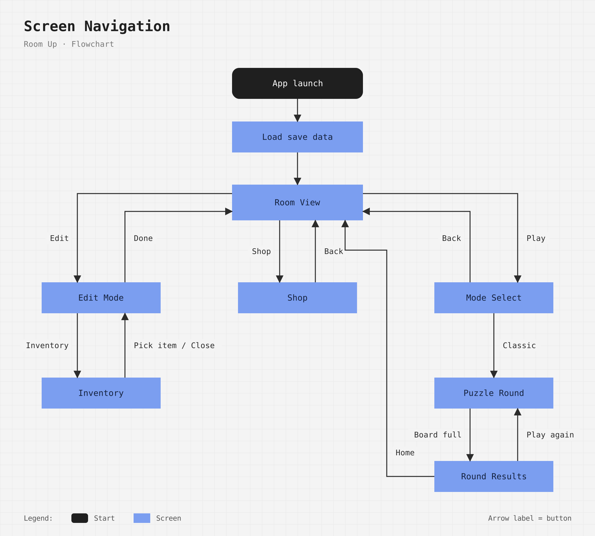
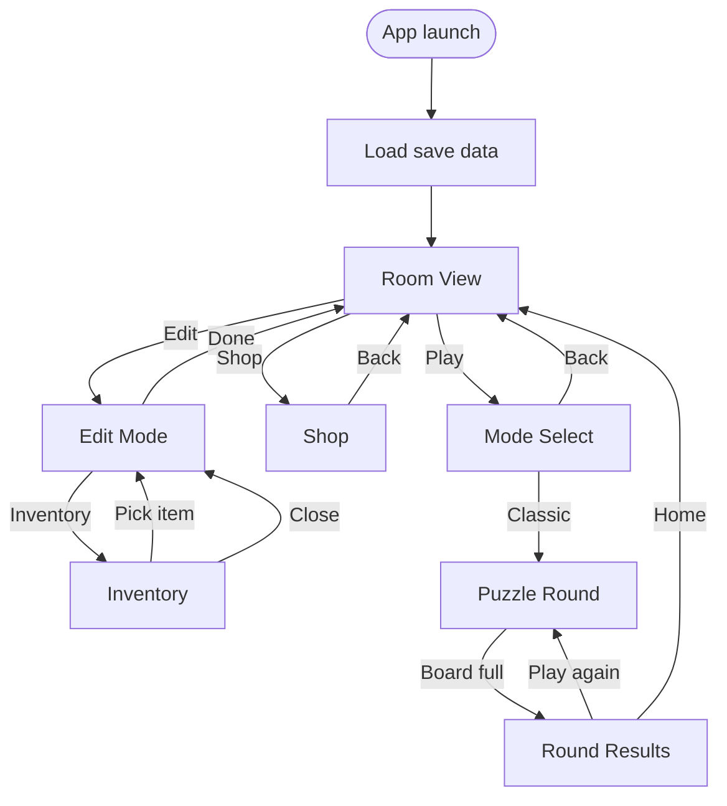
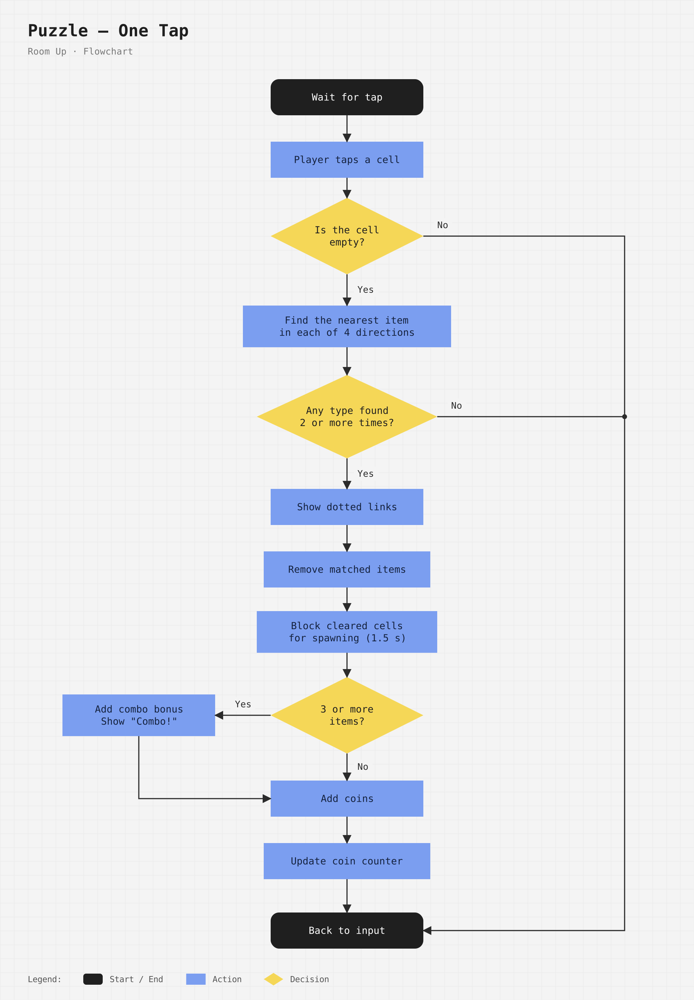
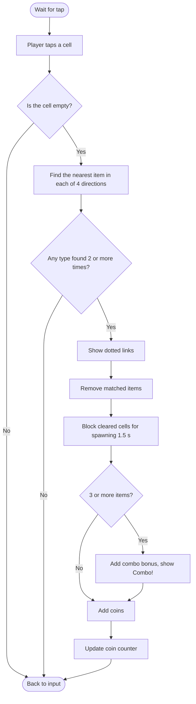
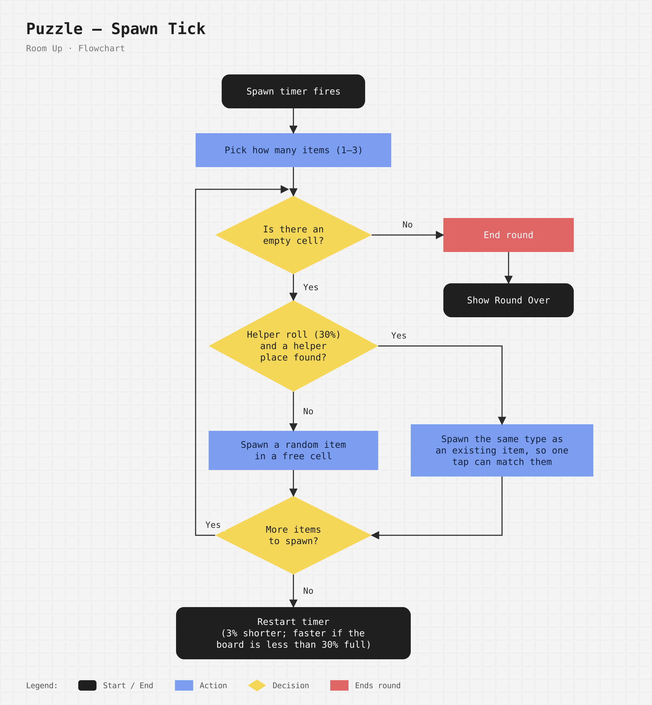
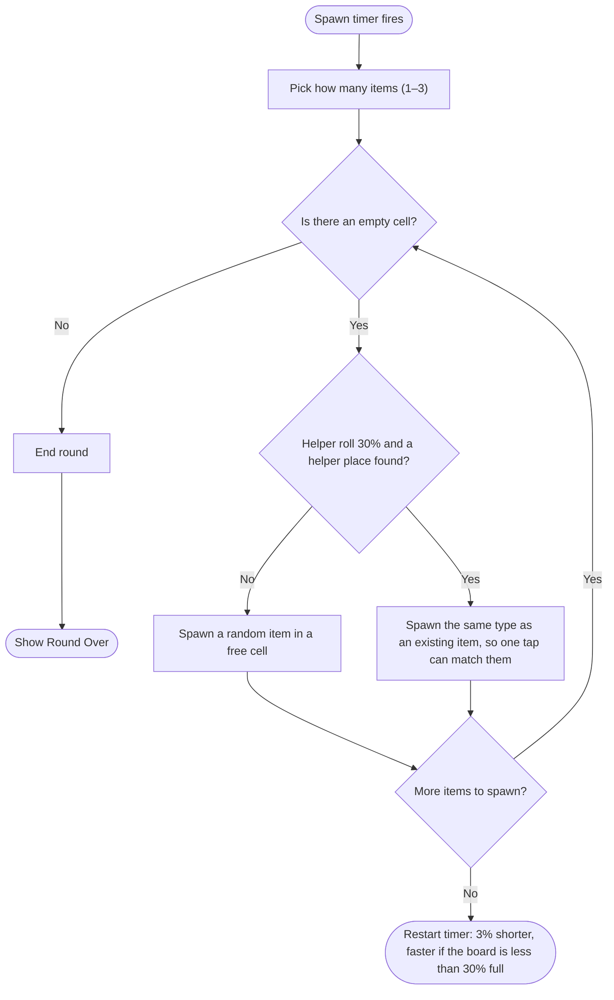

# Flowcharts

This document describes the main flows of **Room Up** (working title).
Each diagram is shown as an image (`docs/diagrams/*.png`, generated by `docs/diagrams/src/flowcharts.py`).
A [Mermaid](https://mermaid.js.org/) version of every diagram is kept under it as a text source.

**Legend**

| Shape | Meaning |
|---|---|
| Black, rounded | Start / end of a flow |
| Blue rectangle | Screen or action |
| Yellow diamond | Decision (yes / no question) |
| Red rectangle | Ends the round |
| Arrow label | Button the player taps, or the answer to a decision |

---

## 1. Screen Navigation

How the player moves between screens.

Mermaid source

> Progress is saved automatically after every purchase, every furniture change and every finished round.

---

## 2. Puzzle — One Tap

What happens when the player taps a cell.

Mermaid source

---

## 3. Puzzle — Spawn Tick

Runs on a timer, independently from the player's taps. This is the only flow that ends a round.

Mermaid source

*A **free cell** is an empty cell that was not cleared in the last 1.5 seconds.*
